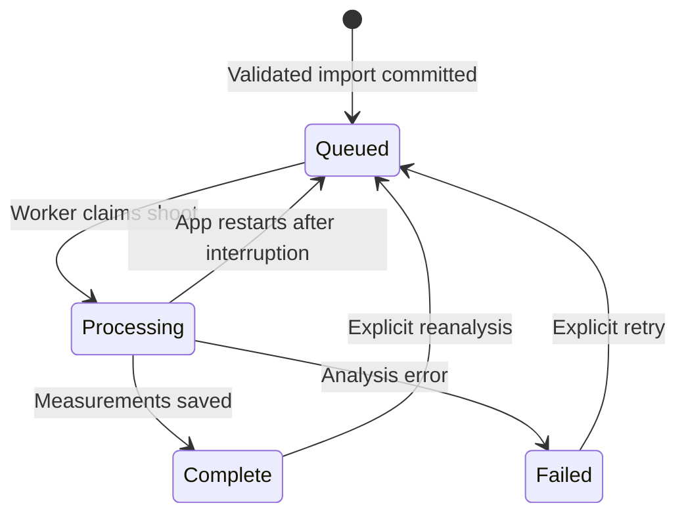

# Prototype architecture and schema

## Runtime

React/TypeScript is built by Vite. FastAPI serves the built interface and `/api` routes on `127.0.0.1:8000`. SQLite stores structured records; ordinary files hold immutable originals, thumbnails, dataset manifests, and model weights. A single background thread processes shoots with durable `queued` state.

The app is single-process and local-only. Use `--workers 1`. There is no authentication. Trusted-host and origin checks reduce unintended browser access, but this is not a multi-user security design. Do not expose it directly to the internet or a shared network. Moving online requires accounts, authorization, object storage, a separate worker queue, and a server database review.

## Tables

| Table | Purpose and important links |
|---|---|
| `conglomerates` | Named parent groups, shared rule overrides, version counter |
| `dealerships` | Optional group FK; separate new/used rule overrides and version |
| `photographers` | Named photographer identity independent of spelling on shoots |
| `vehicle_shoots` | Dealership/photographer FKs; source, mode, purpose, stock, vehicle details, capture date, context, note, processing state, import-time policy snapshot, current-run reference, cached technical score |
| `photos` | Shoot FK, unique shoot/position, original filename, immutable storage keys, SHA-256, dimensions, byte size, selected EXIF, human operational shot type |
| `analysis_runs` | Shoot FK, model FK, pipeline version, frozen policy, run state and timestamps |
| `photo_metrics` | Unique run/photo pair; numeric metrics, technical score, predicted class and confidence |
| `issue_detections` | Run/shoot FKs, optional photo FK, issue type, severity, explanation; null photo denotes whole-shoot problems |
| `review_queue_items` | Shoot/photo/run references, queue/view/resolve timestamps, reviewer annotations, reason and resolution |
| `review_events` | Append-only records of view/note/resolve/reopen actions |
| `training_examples` | Unique photo FK, provenance, current labels, explicit eligibility, label revision and author |
| `training_label_revisions` | Append-only snapshots of each label/eligibility edit |
| `training_datasets` | Immutable manifest key, content hash, seed, exported example count |
| `model_versions` | Model artifact key, dataset FK, class vocabulary, metrics and candidate/active/archived state |

JSON is used for small evolving rule/metric/label payloads, not as a replacement for core relational fields. Schema version 2 is stamped with SQLite `user_version`. Startup migrates version 1 additively with a database backup and rejects unknown versions. `migrations.py` owns explicit column changes; metadata creates new catalog/sequence tables. See [upgrade notes](REVISION-UPGRADE.md). A move to PostgreSQL requires a real data migration and transaction/concurrency review, not simply changing a connection string.

Indexes cover shoot purpose/dealership/date, photographer, stock, photo hash/shot type, run IDs, issue kinds, and review resolution. Current list queries are paginated. The prototype retrieves per-shoot details for the current page; optimize that access pattern before very large libraries.

## Storage layout

```text
QC_DATA_DIR/
  qc.db
  originals/<id-prefix>/<photo-id>.<jpg|png|webp>
  thumbnails/<id-prefix>/<photo-id>.jpg
  datasets/<dataset-id>.json
  models/<model-id>/weights.pt
  models/<model-id>/report.json
  tmp/
```

Files are identified by generated IDs; human metadata can change without moving originals. Original bytes preserve all embedded metadata, including any GPS already present. The EXIF display only extracts selected camera/exposure fields. Thumbnails apply EXIF orientation and omit original metadata.

Imports validate all images before committing the shoot. A handled failure removes files created by that batch and rolls back database rows. A sudden power loss between filesystem writes and the database commit can leave unreferenced files; a future maintenance command should reconcile those. No existing original is overwritten. Keep a full offline backup rather than just copying a live `qc.db` file.

## State and processing



Each analysis run records its own version and policy. The current run is exposed separately from historical runs. Manual shot changes mark required-shot checks stale; reanalysis refreshes them. The score remains a technical-only score regardless of required-shot findings.

Review items are grouped per problematic photo/run, or per shoot for count/sequence issues. Existing open items are retained across reruns, preserving the original reason/run. New current findings are visible in the detail window. Once an item is resolved, a later run may open a new item if a problem remains. Opening a queue item marks it viewed, never resolved. History is retained after resolution. Counts represent queue items, not unique vehicles or issue detections.

Training examples reference existing photos, so promotion creates no image copy. Label edits use optimistic revision checking; stale writes return 409. Approval is explicit and independent of operational inference. Exported snapshots keep the exact approved labels at that point in time even if later edits exclude the photo.

## Standards

Effective values are application defaults → conglomerate overrides → inventory-specific dealership overrides. Required-shot arrays replace the inherited array as a whole. Every import freezes the effective values and group/dealer version numbers. Setup changes affect future imports. Reanalysis deliberately keeps the shoot's existing snapshot.

Configured but unimplemented standards (angle tolerance, banner clearance enforcement) are clearly marked as saved-for-later or preview-only. They do not generate invented pass/fail results.

## API groups

| Routes | Role |
|---|---|
| `GET /api/health`, `/api/config`, `/api/dashboard` | Runtime, setup data, operational overview |
| `POST/PUT /api/groups`, `/api/dealerships`, `/api/photographers` | Create/edit organization and standards |
| `POST /api/shoots` | Multipart ordered files + JSON metadata form field |
| `GET /api/shoots`, `/api/shoots/{id}` | Filtered browsing and full shoot detail |
| `POST /api/shoots/{id}/reanalyze` | Queue another run using the frozen standards |
| `GET /api/photos/{id}/thumbnail` or `/original` | Stored image bytes |
| `PUT /api/photos/{id}/shot` | Human operational shot classification |
| `POST/PUT /api/photos/{id}/training` | Promote photo, then save versioned training labels |
| `GET /api/reviews`, `PATCH /api/reviews/{id}` | Filter review history; view/note/resolve/reopen |
| `POST /api/datasets`, `GET /api/datasets/{id}` | Create/download immutable approved-label manifests |
| `GET /api/models`, `POST /api/models/{id}/activate` | Inspect candidates and activate a locally loadable model |
| `POST /api/models/deactivate` | Return to manual shot classification |

Live request schemas and validation constraints are generated at `/docs`.

## References used during implementation

- FastAPI file uploads: https://fastapi.tiangolo.com/tutorial/request-files/
- SQLAlchemy SQLite dialect and foreign-key support: https://docs.sqlalchemy.org/en/20/dialects/sqlite.html
- Vite setup: https://vite.dev/guide/
- PyTorch install selector: https://pytorch.org/get-started/locally/
- Torchvision ResNet18 and weights preprocessing: https://docs.pytorch.org/vision/stable/models/generated/torchvision.models.resnet18.html
