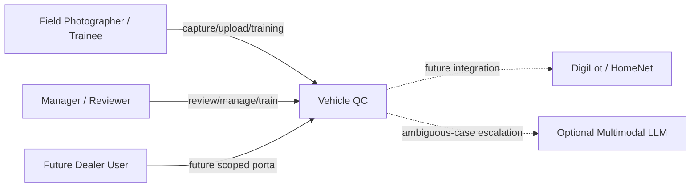
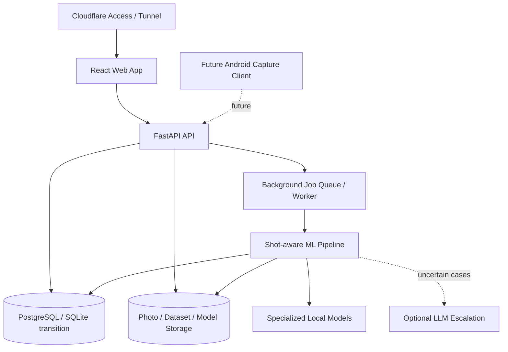

# Vehicle QC — C4 Architecture

This document is the text-readable architecture view for developers and AI agents. Richer FigJam/Figma diagrams may reference this file, but this repository version remains the durable machine-readable architecture description.

## System Context

## Container View — Current / v0.2 Direction

## Architecture notes

- Web remains the primary manager/reviewer/dealer interface.
- Native Android is a future capture client, not a separate product data model.
- The API/domain layer must remain usable by web, Android, and any future PC operations console.
- Shot-aware routing identifies the shot before specialized checks run.
- Specialized model families are versioned independently.
- External dealer users must be scoped to authorized dealerships/groups.
- A future PC operations console should complement the web app rather than replace it.

Update this file when the current architecture materially changes. Future-state ideas should be clearly labeled.
